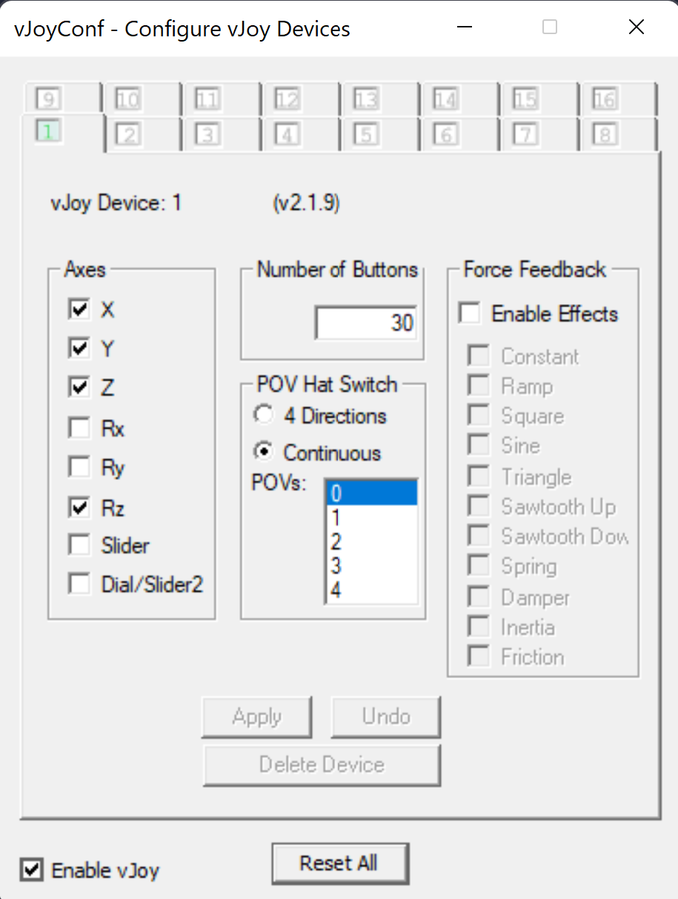
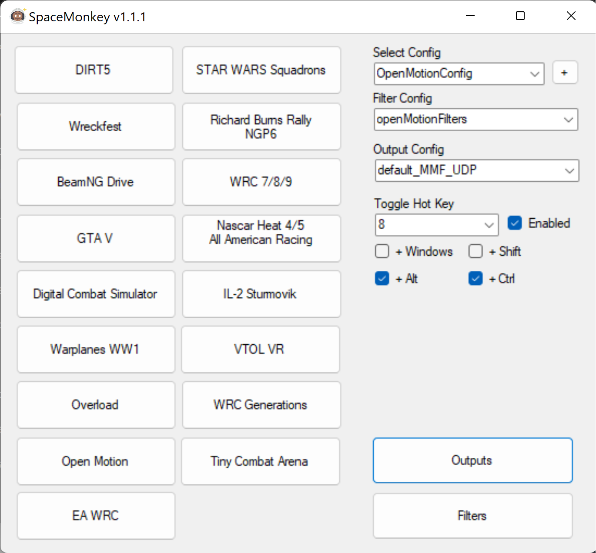
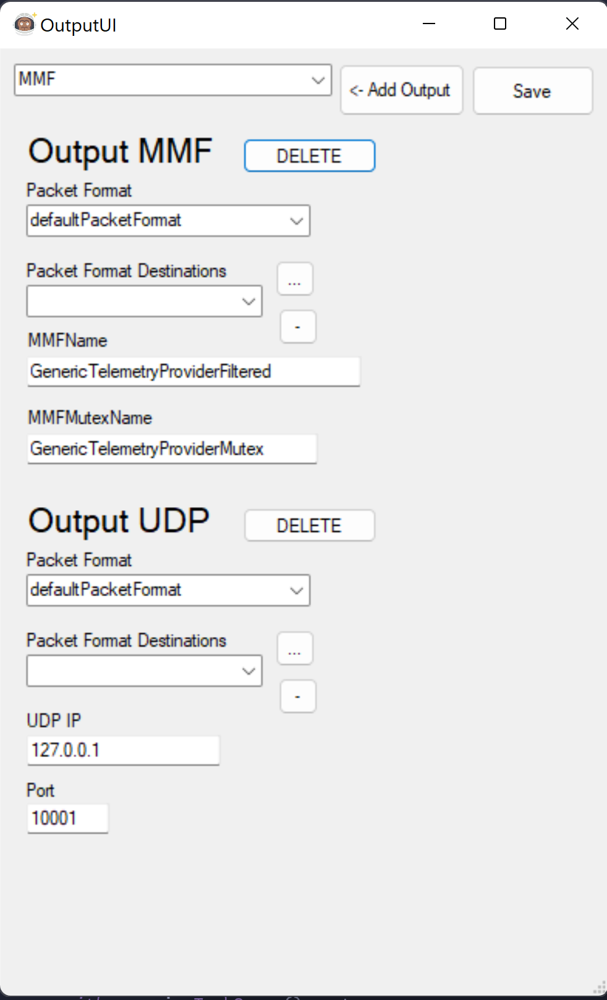

# MW5_FFB
A python script to inject force feedback effects into a Microsoft Sidewinder Force Feedback 2 from MechWarrior 5: Mercs telemetry 

It also binds the pov hat to extra buttons and adds another "layer" for the buttons, giving you 30 buttons. 

## How does it work 
I have written a python script that does two things. Take telemetry and uses that to drive force 
feedback effects and read the joystick and use that to drive a virtual joystick for the game to read.

It gets the telemetry from the [Space Monkey](https://github.com/PHARTGAMES/SpaceMonkey) program. 
That sends it to this program as UDP packets.

To read and command the joystick I have written a python extension to read/control a 
Microsoft Sidewinder Force Feedback 2 joystick. You can find that [here](https://github.com/HappyFox/SidewinderFFB2) 
and [here](https://pypi.org/project/SidewinderFFB2/).

For some reason MechWarrior 5 doesn't like to read the Sidewinder, so you have to pass it to virtual joystick. 
The script uses [vjoy](https://github.com/njz3/vJoy/) with [pyvjoy](https://github.com/tidzo/pyvjoy) python bindings.

## Setup

1. Get a Microsoft Sidewinder Force Feedback 2 joystick, set as the preferred joystick. No drivers are needed on Windows 11.
2. You will then need to setup vjoy and configure it like this:

3. Setup SpaceMonky, make sure it works with MW5. Have it configured like this:

